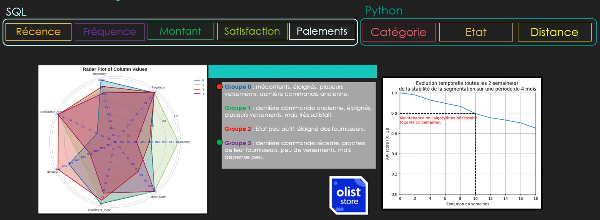

# Segmentation-clients-data_p5
Livrables réalisés pour le projet "Segmentez des clients d'un site e-commerce" (projet n°5) OpenClassroom.

### Contexte projet de formation professionnalisant : 

Vous êtes consultant pour Olist, une entreprise brésilienne de vente sur les marketplaces en ligne, qui recrute
intensivement pour monter une équipe Data.

Les données des clients Olist se retrouve à [cet emplacement](https://www.kaggle.com/datasets/olistbr/brazilian-ecommerce).

Après traitement des données on décompte environ 100K identifiants clients distincts.

## Mission :
Votre rôle initial est d'aider Fernanda, Lead Data Analyst, à implémenter des requêtes SQL urgentes pour le Dashboard de Customer Experience. Ensuite, vous devez fournir une segmentation client exploitable pour les campagnes de communication des équipes d'e-commerce.

### Étapes :

* Support initial :
 Intégrer des requêtes SQL pour le Dashboard Customer Experience.
* Segmentation client :
 Utiliser des méthodes non supervisées pour analyser l'historique des commandes, les produits achetés, les commentaires de satisfaction, et la localisation des clients depuis janvier 2017.
* Créer une segmentation claire et actionable pour l'équipe Marketing.
* Documentation et maintenance :
  Préparer une description de la segmentation pour le marketing.
  Proposer une fréquence de mise à jour de la segmentation pour assurer sa pertinence.

### Livrables :
 - **Gamba_Lucas_1_script_032024** : code des requêtes SQL en amont du projet
 - **Gamba_Lucas_2_notebook_exploration_032024** : Notebook du feature engineering des clients avant apprentissage non-supervisé
 - **Gamba_Lucas_3_notebook_essais_032024** : Notebook avec essais de modélisation avec l'algorithme KMeans et deux autres algorithmes pour comparaison de performance.
 - **Gamba_Lucas_4_notebook_simulation_032024** : Notebook de simulation pour déterminer la fréquence de mise à jour des groupes clients détectés lors de l'apprentissage non supervisé.
 - **Gamba_Lucas_5_presentation_032024** : Présentation Power Point de la démarche de réalisation de la segmentation client.
